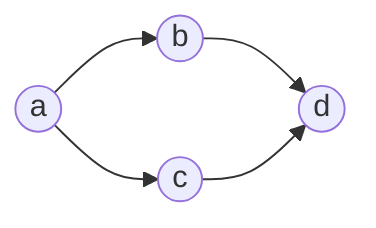
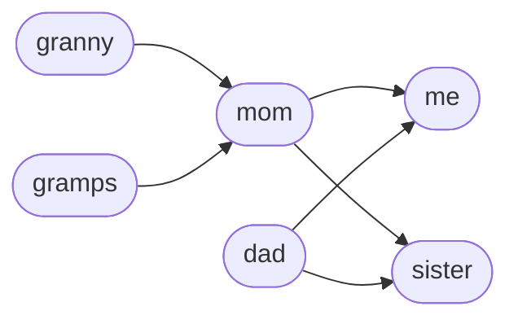
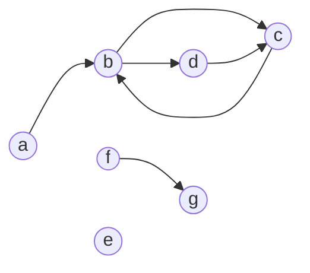
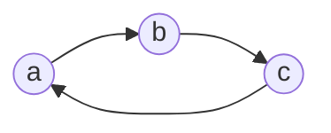

## Why I'm Writing This

So after interviewing at <span class="redacted">:widepeepoMASTURBATION77769420GANGSHITNOMOREFORTNITE19DOLLERFORTNITECARD:</span>, I was asked a graph algorithm question. This is typical of software engineering companies. Unfortunately, it's been a while since I've interviewed or studied graphs, and graph algorithms are my weakness. Needless to say, I didn't do well.

"What was the question?" you're probably wondering. Put simply, it was this:

> Given a directed graph, determine whether the graph has a cycle or not.

I'm leaving out a lot of the build-up and context associated with the question, but the context is irrelevant since I understood the core question in the moment anyway.

Simple question, right? Well, it should be. This is a basic question you can ask about graphs, yet I still struggled with it.

I thought I'd turn this into a learning experience and try to write a blog post about basic graph algorithms. We'll start with coding a representation of a graph, move on to traversals, and then work toward the solution to my interview question. Obviously, I don't claim to be some authority in perfect algorithm implementation, so take this post with a grain of salt. 

Ready? Let's get started :4Evil:

---

## What's a graph, anyway?



At its core, a graph is a collection of **nodes** (also called **vertices**) and **edges**. Nodes represent entities within the graph and edges connect the nodes together.

Edges can be **directed** (meaning there is a "start" and "end" node to every edge) or **undirected** (the nodes are simply related with no ordering given by the edge).

Of course, graphs can be more complex than this (e.g. edges can have cost associated with them), but that extra complexity is outside the scope of this post.

From this basic idea, graphs can be used to represent any group of objects that are related in some way. For example:

- computer networks
- cities and flights between them
- code packages and their dependencies
- family members and their relationships

By transforming real world objects into graphs, we can use graph algorithms to solve problems in their respective domains --- super cool! :ratJAM:

### Coding the Graph

Let's define a class for representing a (directed) graph. I'll use Python, since it is my language of choice for interviewing. This implementation uses an <a href="https://en.wikipedia.org/wiki/Adjacency_list" target="_blank">adjacency list</a> to keep track of the nodes and edges.

```py
class Graph:
    def __init__(self, nodes, edges):
        self.adj = {}

        for node in nodes:
            self.adj[node] = set()

        for (start, end) in edges:
            self.adj[start].add(end)
```

This code can seem a bit abstract, but we'll see how it gets used with an example graph.

### Baby's First Graph

Now that we have the class definition, let's create an example graph. Let's use an example of a family tree:



The code below shows how you would initialize the graph with our `Graph` class.

```py
family = Graph(
    nodes=['granny', 'gramps', 'mom', 'dad', 'me', 'sister'],
    edges=[
        ('granny', 'mom'),
        ('gramps', 'mom'),
        ('mom', 'me'),
        ('dad', 'me'),
        ('mom', 'sister'),
        ('dad', 'sister'),
    ]
)
```

In the code, we provide all available nodes first, then we provide all the edges as ordered pairs of nodes. Each pair `(start, end)` indicates which nodes each edge starts and ends at.

After initialization, the internal adjacency list `family.adj` would look something like this:

<table class="adj-list">
    <thead>
        <tr>
            <th colspan=2 style="text-align: center">
                family.adj
            </th>
        </tr>
    </thead>
    <tbody>
        <tr>
            <td>'granny'</td>
            <td>'mom'</td>
        </tr>
        <tr>
            <td>'gramps'</td>
            <td>'mom'</td>
        </tr>
        <tr>
            <td>'mom'</td>
            <td>'me', 'sister'</td>
        </tr>
        <tr>
            <td>'dad'</td>
            <td>'me', 'sister'</td>
        </tr>
        <tr>
            <td>'me'</td>
            <td><i>(empty)</i></td>
        </tr>
        <tr>
            <td>'sister'</td>
            <td><i>(empty)</i></td>
        </tr>
    </tbody>
</table>

The adjacency list maps every node to a set of nodes it's connected to. Some nodes are only related to one node (`granny`, `gramps`), some have multiple nodes in their set (`mom`, `dad`), and some have none (`me`, `sister`). Nice.

### A Weird Graph

Now, let's see an example of a weirder graph. This one I just pulled out of thin air, so it's just a random graph for graphs' sake. Don't read too much into it.



This graph has some interesting things to note:

- Not all the nodes are connected together.
- `e` is totally isolated from all other nodes.
- This graph has cycles. An example is the one formed by `b -> d -> c -> b`.

The code to generate this graph would look like this:

```py
weird_graph = Graph(
    nodes=['a', 'b', 'c', 'd', 'e', 'f', 'g'],
    edges=[
        ('a', 'b'),
        ('b', 'c'),
        ('c', 'b'),
        ('b', 'd'),
        ('d', 'c'),
        ('f', 'g'),
    ]
)
```

Notice that even if the layout of the graph is pretty complex or exotic, the code itself remains simple to write :blushh:.

---

## Traversing the Graph

Alright, we can represent graphs, but how do we make them useful? For example, we might want to know the answers to these questions:

- What is the shortest path between two computers on a network?
- What installation order should we use when installing a collection of packages that may have dependencies on each other?
- What plane tickets should we buy if we wanted the least amount of transfers between two cities?

All of these problems require being able to _analyze_ the graph somehow. This is where traversals come in.


A **graph traversal** (or **graph search**) involves picking a starting node, then systematically following the outgoing edges to find all the nodes that are reachable from the starting node. The nodes that can be reached by crossing one edge from a given node are called its **neighbors**.

\* _How you choose to proceed at any point in the traversal, along with what information you track along the way, is what specializes and defines a lot of the more complex graph algorithms._

Let's start with the basic algorithms you learn in Algorithms 101: **depth-first search** (**DFS**) and **breadth-first search** (**BFS**). Both of these algorithms start at a given node and traverse all nodes that are reachable from that node.

### Depth-First Search (DFS)

The "depth-first" in this algorithm's name refers to how it prefers going _deeper_ into the graph.


More precisely, DFS will always visit the next available neighbor. This neighbor becomes the "current" node, then DFS will visit the next available neighbor of _this_ node, and so on. When there are no neighbors of the current node, DFS will return to the neighbors it skipped along the way, rinse and repeat. 

This is typically written as a recursive function:

```python
class Graph:
    # other methods above...
    def dfs(self, node, visit, visited=None):
        if visited is None:
            visited = set()

        visit(node)
        visited.add(node)

        for neighbor in self.adj[node]:
            if neighbor not in visited:
                self.dfs(neighbor, visit, visited)
```

What's this `visited` thing? The `visited` set is used to keep track of nodes that have been visited, so that we don't endlessly traverse through nodes we've already been to.

Here's where the interviewer may step in:

> "Nice, but can you make it iterative?"

This is a common follow-up question if you are asked to write DFS in an interview. It's not unreasonable --- the recursive implementation uses the runtime stack to keep track of neighbors, which could end up causing a <a href="https://en.wikipedia.org/wiki/Stack_overflow" target="_blank">stack overflow</a> if the graph has many nodes or edges.

Instead, we can use our own stack data structure for an iterative solution. Rather than call DFS recursively, we push the node to our stack. Here's how that would look:

```python
class Graph:
    # other methods above...
    def dfs_iterative(self, node, visit, visited=None):
        if visited is None:
            visited = set()

        stack = [node]
        while stack:
            node = stack.pop()

            visit(node)
            visited.add(node)

            for neighbor in self.adj[node]:
                if neighbor not in visited:
                    stack.append(neighbor)
```

Now we don't run the risk of a stack overflow :YesYes:.

The interviewer seems impressed, then scribbles in his notepad. After a few seconds, he looks up and asks another follow-up.

> "So, what is the time and space complexity of this algorithm?"

:smile: alright, let's continue.

The **time complexity** of an algorithm refers to how much work the algorithm does as a function of its input size. In our case, the input size can be expressed as two variables: 

- $$V$$: the number of nodes[^1]
- $$E$$: the number of edges

We usually answer this question in <a href="https://en.wikipedia.org/wiki/Big_O_notation" target="_blank">big-O notation</a> which, put bluntly, just means "focus on the pieces of work that matter." This lets us omit work that is insignificant in the long run and write algorithmic complexity in a much neater way.

In our case, we end up scanning the entire graph, so we do some amount of work per node and edge. Thus, our time complexity in big-O is:

$$ O(V + E) $$

**Space complexity** is a similar concept to the time complexity. It is an estimate of how much space the algorithm will use to complete its task, as a function of the input size.

For both implementations, we use a stack (either the runtime stack or our own) to hold at nodes in the graph. In the worst case, we may hold _all_ nodes in the graph. So our space complexity is:

$$ O(V) $$

After presenting this information, the interviewer seems satisfied, for now. Let's move on.

### Breadth-First Search (BFS)

BFS is similar to DFS. It's goal is to visit every node you can reach from a given starting node. However, it's strategy is different. It prefers traversing rings of nodes that move out from the starting node. This is what makes it "breadth-first," since the traversal at any given point is broader than it is deeper into the graph.


BFS is typically written iteratively using a <a href="https://en.wikipedia.org/wiki/Queue_(abstract_data_type)" target="_blank">queue</a> to keep track of the nodes to visit next:

```python
class Graph:
    # other methods above...
    def bfs(self, node, visit, visited=None):
        if visited is None:
            visited = set()

        queue = [node]
        while queue:
            front = queue.pop(0)

            visit(front)
            visited.add(node)

            for node in self.adj[node]:
                if node not in visited:
                    queue.append(node)
```

Notice how iterative DFS and BFS are effectively the same algorithm --- they just use a different data structure to handle the neighbors on each loop.

Oh and before I forget --- we traverse all nodes and edges and keep track of the nodes in a queue, so for BFS:

- Time Complexity: $$O(V + E)$$
- Space Complexity: $$O(V)$$

---

## Cycles



We've reached the final boss --- at least in my case. Here's what we need to do again:

> Given a directed graph, determine whether the graph has a cycle or not.

Consider a depth-first search. While we traverse the graph, we could keep track of the nodes used to reach the current node --- our **path**.


If we notice we run into a node we've already been to, then we know there must be a cycle in the graph: namely, the one formed by our traversal path.


We can modify our DFS algorithm to keep track of the path. Let's call it `has_cycle_helper`:

```python
class Graph:
    # other methods above...
    def has_cycle_helper(self, node, path, visited):
        path.add(node)
        visited.add(node)

        for neighbor in self.adj[node]:
            if neighbor in path:
                return True

            if neighbor not in visited and self.has_cycle_helper(neighbor, path, visited):
                return True

        path.remove(node)
        return False

    def has_cycle(self):
        visited = set()
        path = set()
        for node in self.adj:
            if node not in visited and self.has_cycle_helper(node, path, visited):
                return True
        return False
```

In `has_cycle_helper`, we keep track of our path by adding a node to it whenever we enter another level of recursion, and removing it whenever we're about to return from it. This will make sure our path stays up to date during our entire traversal.

If we see a neighbor who is part of our path, that means there's a cycle. The rest of the code is just DFS as usual.

`has_cycle` just calls the helper on all nodes in the graph. It's possible that not all the nodes are connected, so some of the helper calls may not reach the entire graph just based on the node we start from. Calling the helper starting from every node will provide the coverage we need.

Since this is just DFS with a bit of extra bookkeeping (i.e. the `path` set), our complexities are the same:
- Time Complexity: $$O(V + E)$$
- Space Complexity: $$O(V)$$

And... that's it. This is admittedly not a rigorous proof, but the correct algorithms I've seen out there are really this simple.

## Resources

- <a href="/assets/graph-algorithms/graph.py">graph.py</a> - All the code in this post.
- <a href="https://www.cs.cornell.edu/courses/cs2112/2012sp/lectures/lec24/lec24-12sp.html" target="_blank">Graph traversals</a> - An in-depth set of notes on graph traversals using graph coloring. This post explains the algorithms in a much more formal way while categorizing edges, etc.
- <a href="https://www.cs.usfca.edu/~galles/visualization/Algorithms.html" target="_blank">Data Structure Visualizations</a> - A neat set of visualization demos for common data structures and algorithms, provided by the University of San Francisco.

## Footnotes

[^1]: Yes, we use the letter $$V$$. This is because in graph theory, people say "vertices" instead of "nodes." A lot of graph time/space complexity is written using this form. $$N$$ is typically used for simpler data structures like arrays, binary trees, etc.
